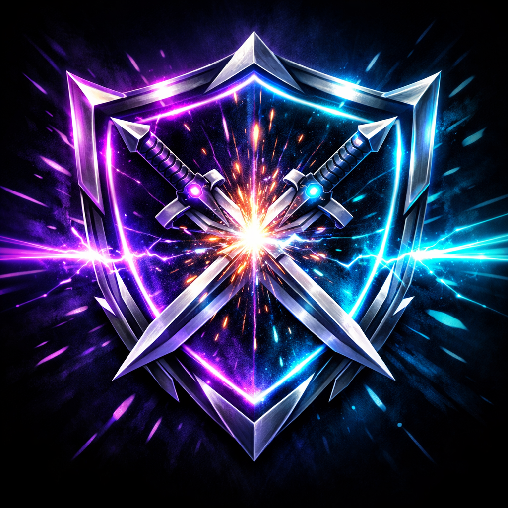
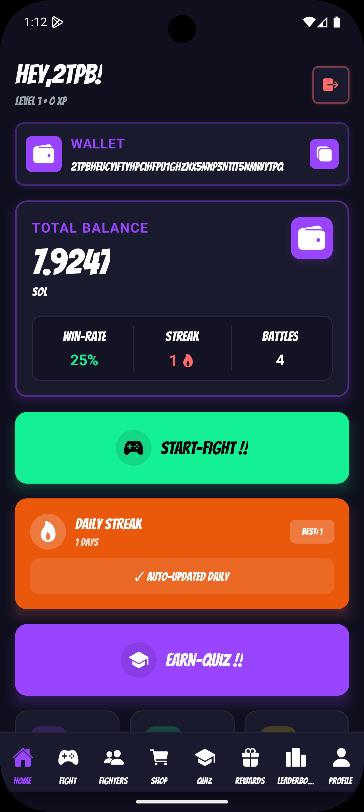
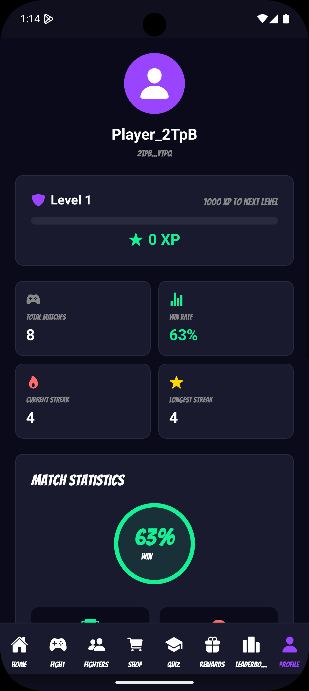
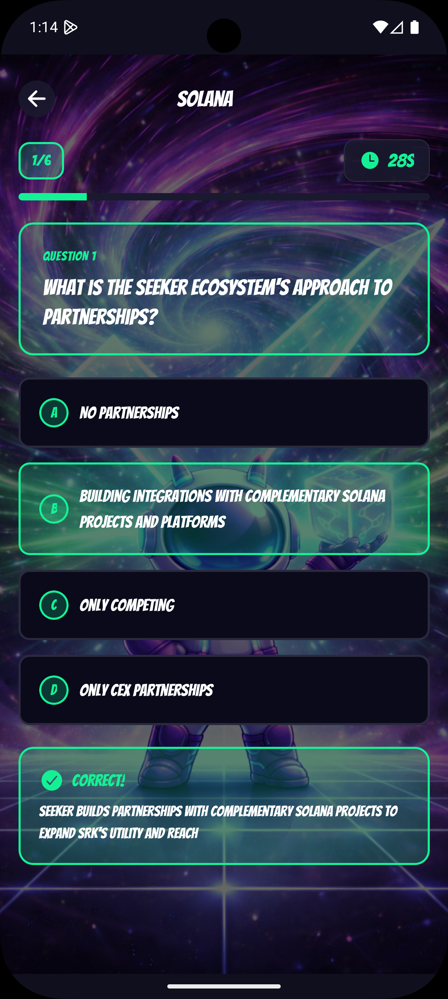
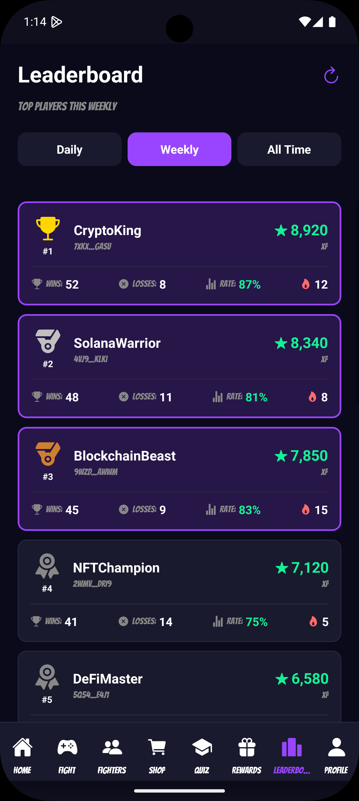
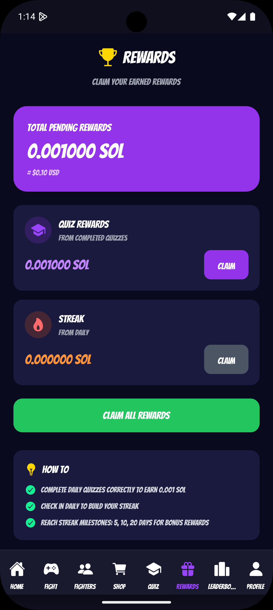
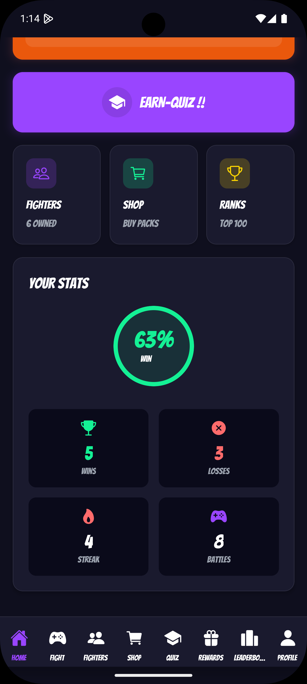

# ClashGo

<div align="center">
  
  
  ### Daily On-Chain Competitive Mobile Game
  **Built for the Solana Mobile Ecosystem**
  
  [](https://reactnative.dev/)
  [](https://solana.com/)
  [](https://www.anchor-lang.com/)
  [](https://expo.dev/)
  
  ### [Live Demo](https://clashgo.vercel.app/)
</div>

---

## Application Screenshots

<table>
  <tr>
    <td width="50%" valign="top">
      <h3>Home Screen</h3>
      
      <p>The main dashboard where players begin their journey. Features quick access to battle modes, daily challenges, and current streak status. The interface displays the player's XP level, available game modes, and daily mystery box claim status. Clean, intuitive navigation ensures players can jump into action within seconds.</p>
    </td>
    <td width="50%" valign="top">
      <h3>Game Mode Selection</h3>
      
      <p>Players choose between different battle types including Quick Match (free entry), Ranked Match (small SOL entry), and Daily Prediction Challenge. Each mode displays potential rewards, current player count, and estimated wait time for matchmaking. The interface clearly communicates the risk-reward balance for each option.</p>
    </td>
  </tr>
  <tr>
    <td width="50%" valign="top">
      <h3>Fighter Selection</h3>
      
      <p>Character selection screen showcasing available fighters with unique visual designs. Each fighter represents different playstyles and abilities. Players can view their collection, unlock progress, and select their preferred character before entering battle. This adds personalization and progression depth to the competitive experience.</p>
    </td>
    <td width="50%" valign="top">
      <h3>Player Profile</h3>
      
      <p>Comprehensive profile view displaying player statistics, including total XP, current level, win/loss ratio, and active streak count. Shows connected wallet address, earned badges, and overall ranking. Players can track their progression journey and view their competitive standing within the community.</p>
    </td>
  </tr>
  <tr>
    <td width="50%" valign="top">
      <h3>Quiz Challenge</h3>
      
      <p>Daily prediction and trivia challenge interface where players answer Web3-related questions, predict SOL price movements, or guess network fee ranges. Features a countdown timer, question display, and multiple-choice answers. Correct predictions earn XP and maintain daily streaks, encouraging consistent engagement.</p>
    </td>
    <td width="50%" valign="top">
      <h3>Global Leaderboard</h3>
      
      <p>Weekly leaderboard displaying top players ranked by XP earned during the current cycle. Shows player rankings, usernames, XP totals, and win streaks. The leaderboard resets weekly to maintain competitive balance and give all players fresh opportunities to climb the ranks. Real-time updates reflect the latest battle results.</p>
    </td>
  </tr>
  <tr>
    <td width="50%" valign="top">
      <h3>Rewards & Mystery Box</h3>
      
      <p>Daily mystery box claim interface offering free rewards including XP boosts, temporary streak multipliers, and chances to earn rare soulbound badges. Premium mode option allows small SOL entry for enhanced reward probability. Visual feedback shows reward rarity and claim history, creating anticipation and encouraging daily logins.</p>
    </td>
    <td width="50%" valign="top">
      <h3>Player Statistics</h3>
      
      <p>Detailed analytics dashboard presenting comprehensive player performance metrics. Includes battle history, win rate trends, XP progression graphs, most-played game modes, and peak performance times. Provides insights into player improvement over time and helps identify strengths and areas for growth.</p>
    </td>
  </tr>
</table>

---

## Vision

ClashGo is a mobile-first competitive micro-game designed specifically for the Solana Mobile ecosystem.

The goal is to create a fast, addictive, daily on-chain competitive experience where users engage in 60-second PvP battles, earn XP, maintain streaks, and climb global leaderboards.

---

## How ClashGo Expands the Solana Ecosystem

### Mobile-First Blockchain Gaming
ClashGo demonstrates the power of Solana Mobile by creating a seamless, native mobile experience that integrates blockchain technology without compromising user experience. This showcases Solana's capability to support high-performance mobile dApps.

### Daily On-Chain Engagement
By implementing daily challenges, streak systems, and mystery boxes, ClashGo drives consistent on-chain activity, increasing transaction volume and network engagement on Solana.

### Micro-Transaction Economy
The game introduces a sustainable micro-transaction model with optional SOL entry modes, demonstrating how blockchain games can monetize without complex tokenomics while keeping the barrier to entry low.

### Soulbound NFT Badges
ClashGo utilizes Solana's NFT capabilities to create non-transferable achievement badges, showcasing innovative use cases for digital assets beyond trading and speculation.

### Developer Blueprint
As an open-source project, ClashGo serves as a reference implementation for developers looking to build mobile-native games on Solana, complete with wallet integration, Anchor programs, and React Native best practices.

### User Onboarding
The free-to-play mode with optional micro SOL entries provides an accessible entry point for Web2 users to experience blockchain gaming, helping grow the Solana user base.

---

## Problem Statement

Most Web3 applications struggle with daily engagement and long-term retention. Many dApps function primarily as financial tools rather than fun consumer experiences.

Solana Mobile requires high-stickiness, mobile-native applications that deliver meaningful on-chain interaction while remaining engaging and easy to use.

---

## Solution Overview

ClashGo introduces:

- 60-second PvP micro battles
- Daily streak multiplier system
- On-chain XP tracking
- Soulbound achievement badges
- Weekly global leaderboards

This creates a competitive habit loop powered by on-chain interaction.

---

## Core Gameplay – PvP Battle Arena

### Flow

1. User connects wallet via Solana Mobile Wallet Adapter
2. User joins a match (free mode or small SOL entry)
3. Auto-matching pairs the player with another competitor
4. 60-second challenge begins (tap-speed, reaction, or trivia)
5. Smart contract settles the result on-chain
6. XP and optional SOL rewards are distributed on-chain

This ensures fast gameplay with meaningful blockchain interaction.

---

## Daily Prediction Challenge

Once per day, users can:

- Predict SOL price movement (up/down)
- Answer a mini Web3 trivia question
- Guess network fee range

Users sign a transaction, optionally stake a small amount of SOL, and earn XP based on accuracy.

This creates an additional daily engagement hook.

---

## Mystery Box (Retention Hook)

Daily free claim includes:

- Small XP reward
- Chance to receive a rare badge
- Temporary streak boost
- Premium mode:
  - Small SOL entry
  - Higher reward probability

This guarantees daily open behavior.

---

## Streak & XP System

- Daily login streak tracking
- 7-day streak badge reward
- 30-day rare badge reward
- XP ladder progression system
- Weekly leaderboard reset

This creates long-term engagement and competitive motivation.

---

## On-Chain Architecture (Anchor Program)

### Core Accounts

- `PlayerProfile` - User profile and stats
- `XPAccount` - Experience points tracking
- `StreakAccount` - Daily streak management
- `MatchPool` - PvP matchmaking pool
- `PredictionPool` - Daily prediction challenges
- `RewardVault` - Prize distribution
- `BadgeMint` - Soulbound NFT badges

### Core Instructions

```rust
initialize_player()
join_match()
submit_score()
settle_match()
submit_prediction()
claim_mystery_box()
update_streak()
mint_badge()
```

All major interactions are settled on-chain to ensure transparency and fairness.

---

## Tech Stack

| Component | Technology |
|-----------|-----------|
| **Frontend** | React Native (Android-first design) |
| **Blockchain** | Solana + Anchor framework |
| **Wallet Integration** | Solana Mobile Wallet Adapter |
| **Backend** | Node.js (match coordination only) |
| **Database** | PostgreSQL Neon Cloud (off-chain stats caching) |
| **Deployment** | Functional Android APK required for submission |

---

## Economy Design

- Free mode available
- Optional micro SOL entry mode
- XP is non-transferable
- Badges are soulbound
- No complex inflationary tokenomics

This ensures sustainability and simplicity.

---

## Demo Flow for Judges

1. Connect wallet
2. Join live battle
3. Play 60-second match
4. Show on-chain transaction confirmation
5. XP and leaderboard update
6. Claim mystery box reward
7. Fast, clear, and visually engaging demo sequence

---

## Getting Started

### Prerequisites

- Node.js (v18 or higher)
- Expo CLI
- Android Studio (for Android development)
- Solana CLI
- Anchor CLI
- Rust toolchain

### Installation

1. **Clone the repository**
```bash
git clone https://github.com/chetanck03/solana-gamefi
cd solana-gamefi
```

2. **Install dependencies**
```bash
npm install
```

3. **Install Anchor dependencies**
```bash
cd anchor
npm install
cd ..
```

4. **Set up environment variables**
```bash
cp .env.example .env
# Edit .env with your configuration
```

5. **Build Anchor program**
```bash
cd anchor
anchor build
anchor deploy
cd ..
```

6. **Start the development server**
```bash
npm start
```

7. **Run on Android**
```bash
npm run android
```

---

## Project Structure

```
clashgo/
├── anchor/                 # Solana Anchor programs
│   ├── programs/          # Smart contracts
│   ├── tests/             # Program tests
│   └── migrations/        # Deployment scripts
├── src/                   # React Native source code
│   ├── screens/          # App screens
│   ├── components/       # Reusable components
│   ├── hooks/            # Custom React hooks
│   ├── utils/            # Utility functions
│   └── services/         # API and blockchain services
├── assets/               # Images, fonts, and media
│   ├── pics/            # Screenshot images
│   ├── characters/      # Game character assets
│   ├── battle-icons/    # Battle UI icons
│   └── fonts/           # Custom fonts
├── components/          # Shared components
├── App.tsx             # Main app entry point
└── package.json        # Dependencies
```

---

## Key Features

### PvP Battle System
- Real-time matchmaking
- 60-second quick matches
- Multiple game modes (tap-speed, reaction, trivia)
- On-chain result settlement

### Progression System
- XP tracking and leveling
- Daily streak rewards
- Weekly leaderboards
- Achievement badges

### Reward Mechanics
- Daily mystery boxes
- Streak bonuses
- Soulbound NFT badges
- Optional SOL rewards

### Blockchain Integration
- Solana Mobile Wallet Adapter
- Anchor program integration
- On-chain transaction verification
- Transparent and fair gameplay

---

## Contributing

Contributions are welcome! Please feel free to submit a Pull Request.

1. Fork the project
2. Create your feature branch (`git checkout -b feature/AmazingFeature`)
3. Commit your changes (`git commit -m 'Add some AmazingFeature'`)
4. Push to the branch (`git push origin feature/AmazingFeature`)
5. Open a Pull Request

---

## License

This project is licensed under the MIT License - see the [LICENSE](LICENSE) file for details.

---

## Why ClashGo Matters

ClashGo represents the future of mobile blockchain gaming on Solana:

- **Accessibility**: Free-to-play with optional micro-transactions
- **Engagement**: Daily challenges and competitive gameplay
- **Innovation**: Soulbound badges and on-chain progression
- **Sustainability**: Simple economy without complex tokenomics
- **Mobile-First**: Built specifically for Solana Mobile
- **Open Source**: Reference implementation for developers

By combining addictive gameplay with meaningful blockchain integration, ClashGo demonstrates how Solana can power the next generation of mobile gaming experiences.

---

<div align="center">
  
  ### Built for the Solana Mobile Ecosystem
  
</div>
